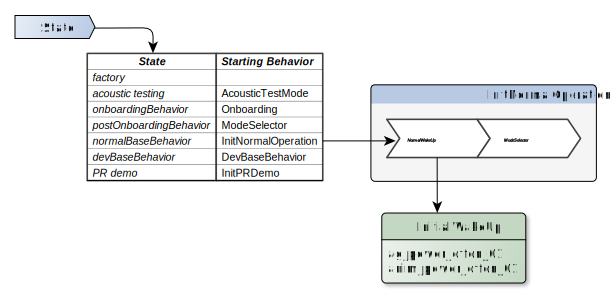

When Vector's application starts, it looks up a top level state to kick off
the initial behavior -- has the robot been tested at the factory?  Has the
owner gone thru on boarding?  And so on. 

This behavior is the root of the behavior tree that
Vector will use.  There are 7 of these broad, top level states:

* PR demo
* Factory test  (e.g. the playpen tests)
* Acoustic testing
* On-boarding
* Post on-boarding
* Normal
* Developer

*Note: when Vector exits the Customer Care screens, it resumes operation
by re-running the top level behavior.*

## Mapping to the initial behavior

Note: all of the behavior related files are in the following directory, and
sub-directories:

     /anki/data/assets/cozmo_resources/config/engine/behaviorComponent

These top-level states are mapped to initial behavior using
`victor_behavior_config.json`

*Figure: The start-up behavior tree*

(In a few cases the mapping is hardcoded in the software.)

In normal operation, this is the `InitNormalOperation` behavior.  The behavior
file is located at:

   behaviors/victorBehaviorTree/initNormalOperation.json

## Walk thru of the InitNormalOperation behavior

When the `InitNormalOperation` (class `DispatcherStrictPriorityWithCooldown`)
behavior first starts, it does a one-off run of a `NormalWakeUp`  behavior.
This behavior is not run when `InitNormalOperation`
is started again later.  (For instance, it is run again when the Customer
Care screens are exited.)  This one-shot execution is acheived by using 
settings its cooldown timer to a period that is infinitely long.

The `NormalWakeUp` (class`AnimSequence`) behavior checks to see that it is not
night time, and not a maintenance reboot.  It isn't, then it triggers the
`InitialWakeUp` animation group.  The animation affect Vectors eyes, head angle,
backpack lights, and sounds. (There are not any other movements).  This behavior
file is located at:

    behaviors/victorBehaviorTree/normalWakeUp.json

After this it defers to `ModeSelector` behavior for the top level, prioritized
behavior dispatch.

## Other variations

There are three other animation variations on Vector that are currently not
used:

* `anim_power_offon_02`
* `anim_power_offon_03`
* `anim_power_offon_04`

## Change history synopsis

|Date|Change|
|----|------|
|2020-11-29|Created, setup format|
|2020-11-30|Added file references|

